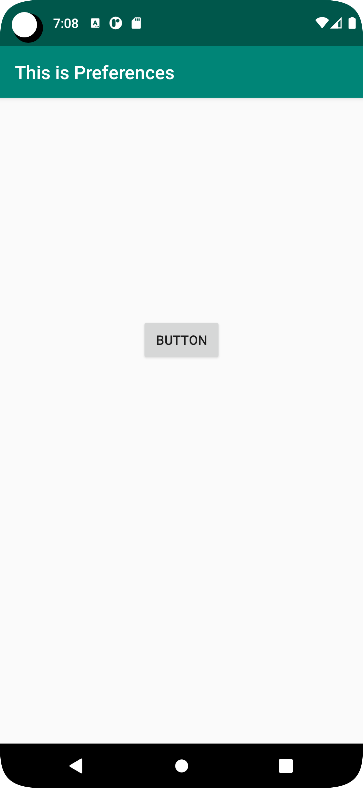
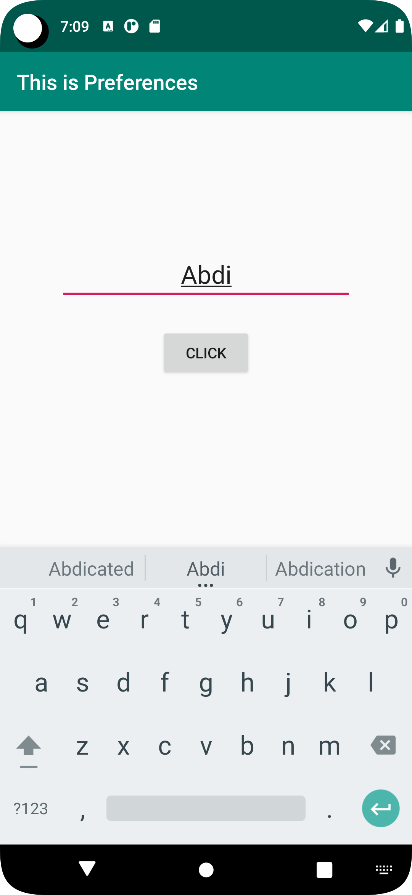

# Rapport

Först och främst har appen utvecklats med två aktiviteter. Den första aktiviteten används
för att läsa data från SharedPreferences som har sparats tidigare för senare användning.

Dessutom har appen en ny aktivitet som heter SecondActivity för att organisera användargränssnittet 
och möjliggöra navigering mellan olika skärmar.

I SecondActivity används ett EditText-element som tillåter användaren att mata in data. 
Därefter sparas datan i appens SharedPreferences, som kan nås senare. När SecondActivity stängs kan 
den sparade datan synas i MainActivity. Detta innebär att datan som sparats i SecondActivity kan nås
från andra delar av appen.

## Koden:


```
public class MainActivity extends AppCompatActivity {
    private Button button;
    private TextView sharedresult;
    private final String key = String.valueOf(R.string.viewData);
    private SharedPreferences myPreferenceRef;
    private SharedPreferences.Editor myPreferenceEditor;


    @Override
    protected void onCreate(Bundle savedInstanceState) {
        super.onCreate(savedInstanceState);
        setContentView(R.layout.activity_main);
        Toolbar toolbar = findViewById(R.id.toolbar);
        setSupportActionBar(toolbar);

        button = findViewById(R.id.sendButton);
        sharedresult = findViewById(R.id.textViewName);

       myPreferenceRef = getPreferences(MODE_PRIVATE);
        myPreferenceEditor = myPreferenceRef.edit();
    button.setOnClickListener(new View.OnClickListener() {
        @Override
        public void onClick(View view) {

            openSecondActivity();
        }
    });
        }

    @Override
    protected void onResume() {
        super.onResume();
        Log.d("d22abdha", " startActivity");
        String defaultValue = "Nothing has been shared.";
        SharedPreferences sharedPref = getSharedPreferences(key, MODE_PRIVATE);
        sharedresult.setText(sharedPref.getString(key, defaultValue));
    }
    public void openSecondActivity() {
        Intent intent = new Intent(MainActivity.this, SecondActivity.class);
        startActivity(intent);
    }

}

```

```
 <TextView
        android:id="@+id/textViewName"
        android:layout_width="wrap_content"
        android:layout_height="wrap_content"
        android:text="@string/app_name"
        android:textSize="18sp"
        android:padding="8dp"
        app:layout_constraintBottom_toBottomOf="parent"
        app:layout_constraintEnd_toEndOf="parent"
        app:layout_constraintStart_toStartOf="parent"
        app:layout_constraintTop_toBottomOf="@+id/appBarLayout"
        app:layout_constraintVertical_bias="0.30" />


    <Button
        android:id="@+id/sendButton"
        android:layout_width="wrap_content"
        android:layout_height="wrap_content"
        android:text="write something new"
        app:layout_constraintTop_toBottomOf="@id/textViewName"
        app:layout_constraintStart_toStartOf="@id/textViewName"
        app:layout_constraintEnd_toEndOf="@id/textViewName"/>
```

```
public class SecondActivity extends AppCompatActivity {
    private SharedPreferences sharedPreferences;
    private final String key = String.valueOf(R.string.viewData);
    private Button button;

    @Override
    protected void onCreate(Bundle savedInstanceState) {
        super.onCreate(savedInstanceState);
        setContentView(R.layout.activity_second);

        sharedPreferences = getSharedPreferences(key, MODE_PRIVATE);

        button = findViewById(R.id.sendButton);
        button.setOnClickListener(new View.OnClickListener() {
            @Override
            public void onClick(View view) {
                storeUserData();
               finish();
            }
        });

    }

    private void storeUserData() {
// Get the user input from the EditText view.
        EditText userInputEditText = findViewById(R.id.viewinput);
        String data = userInputEditText.getText().toString();

// Get an instance of the SharedPreferences object and create an editor.
        SharedPreferences.Editor editor = sharedPreferences.edit();

// Put the user input data into the editor with the given key.
        editor.putString(key, data);
        String key = "sharedPreferences";

// Commit the changes to the SharedPreferences.
        editor.apply();
    }
}
```
```
 <EditText
        android:id="@+id/viewinput"
        android:layout_width="wrap_content"
        android:layout_height="wrap_content"
        android:hint="@string/input"
        android:maxEms="20"
        android:minEms="10"
        android:textSize="24sp"
        android:gravity="center_horizontal"
        app:layout_constraintBottom_toBottomOf="parent"
        app:layout_constraintEnd_toEndOf="parent"
        app:layout_constraintStart_toStartOf="parent"
        app:layout_constraintTop_toTopOf="parent"
        app:layout_constraintVertical_bias="0.19999999" />


    <Button
        android:id="@+id/sendButton"
        android:layout_width="wrap_content"
        android:layout_height="wrap_content"
        android:layout_marginTop="24dp"
        android:text="Click me"
        app:layout_constraintEnd_toEndOf="@+id/viewinput"
        app:layout_constraintStart_toStartOf="@+id/viewinput"
        app:layout_constraintTop_toBottomOf="@+id/viewinput" />
```

Bilder.





